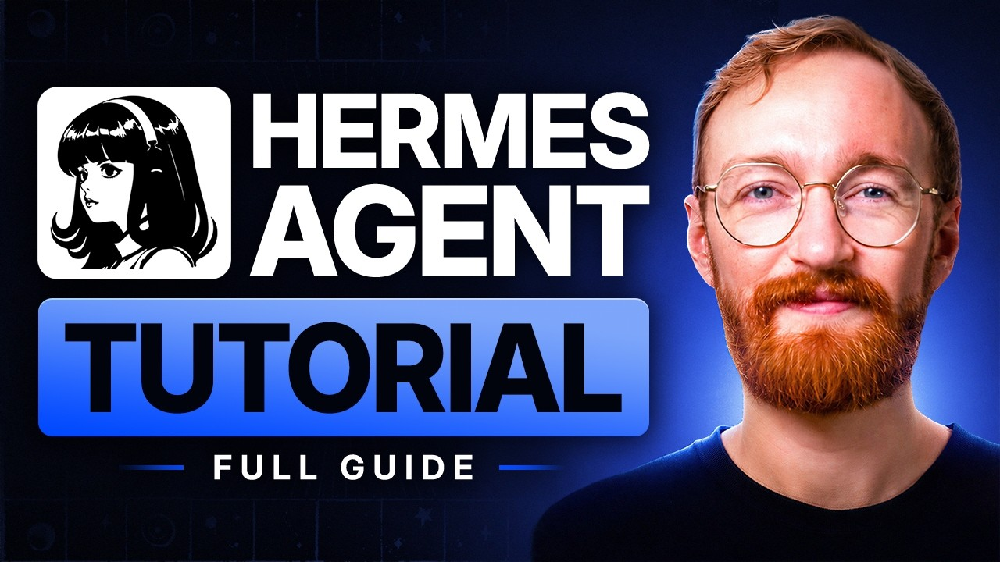
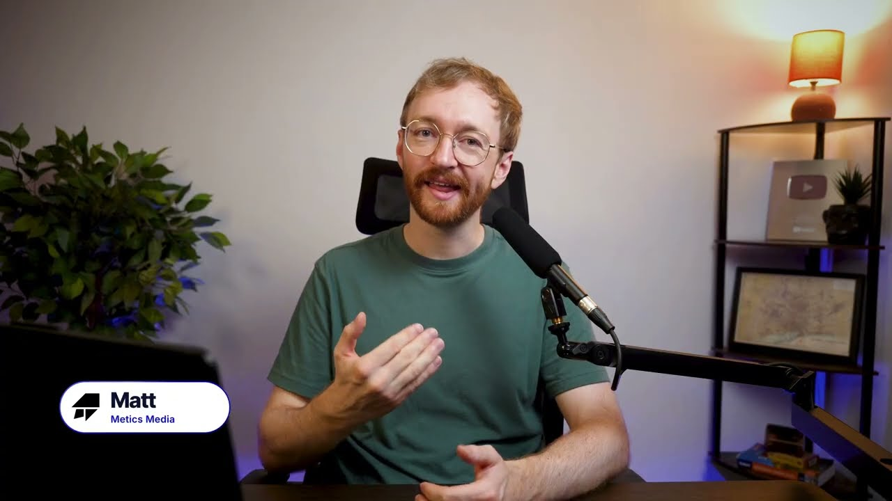

# Ringkasan: Hermes Agent — Tutorial Setup Penuh (untuk Pemula)

> **Sumber:** [“Hermes Agent – Full Tutorial & Setup Guide (For Beginners)”](https://www.youtube.com/watch?v=DYdvJCxWd6M) — Matt, **Metics Media** (YouTube, ±34 minit).
> Ringkasan ini ditulis daripada transkrip video. Harga, nama butang dan langkah ialah yang disebut dalam video dan **mungkin sudah berubah** — ikut alirannya, bukan tangkapan skrin yang tepat (pesanan Matt sendiri).



## Intipati dalam 5 baris

1. **Hermes Agent** ialah ejen AI **sumber terbuka & percuma** (lesen MIT) daripada Nous Research. Anda hanya bayar **model AI** + **pelayan kecil**.
2. Tiga kelebihan berbanding chatbot biasa: **berjalan berterusan** (boleh mulakan perbualan sendiri), **mengingat** (merentas perbualan & peranti), **belajar sendiri** (menulis “skill”).
3. Pasang di **pelayan awan** (Hostinger KVM 1, ≈ US$6/bulan) supaya ia aktif walaupun laptop ditutup.
4. Setup ≈ **30 minit**, tanpa coding: pelayan → otak (OpenRouter) → Telegram → aplikasi desktop → latihan → jadual.
5. Kos sebenar sangat rendah: **105 permintaan = US$0.13**; US$5 ≈ 4,000 mesej dengan model DeepSeek-V4-Flash.

## Analogi video: “mengambil pekerja AI pertama”

| Pekerja | Dalam Hermes | Masa dalam video |
|---|---|---|
| Tempat bekerja | Pelayan awan (VPS) | 04:04 |
| Otak | Model AI melalui OpenRouter | 09:40 |
| Nombor telefon | Bot Telegram (gateway) | 13:44 |
| Latihan | Memori, skill, SOUL.md | 22:43 |
| Jadual | Cron — kerja automatik | 26:16 |

## Langkah demi langkah

### 0. Apa itu Hermes & di mana ia tinggal (01:17 – 04:00)
- Percuma & sumber terbuka; kos = model AI + pelayan.
- **Aplikasi desktop** = cara cepat mencuba, tetapi **berhenti bila laptop tidur**. Ejen berjadual (mis. semak sesuatu jam 4 pagi) memerlukan pelayan sendiri.
- **Keselamatan:** ejen menulis fail, menjalankan kod dan melayari web. Laman web boleh menyelitkan arahan berniat jahat (*prompt injection*). Di pelayan khas, paling teruk hanya satu kotak kosong terdedah — bukan fail peribadi anda. Ia juga meminta kebenaran sebelum tindakan berisiko.

### 1. Tempat kerja — Hostinger (04:04 – 08:03)
1. Pilih pelan **KVM 1** (terkecil; boleh naik taraf kemudian tanpa pasang semula).
2. Tempoh bil: minimum **12 bulan** untuk kupon automatik; ada **jaminan wang balik 30 hari**.
3. **Nyahtanda** “Ready to Use AI” (menambah ≈ US$12 kredit perkhidmatan lain yang tidak diperlukan). Biarkan add-on lain mati.
4. Daftar akaun & bayar → borang deploy Hermes: nama pengguna `hermes`, **salin & simpan kata laluan admin** dalam pengurus kata laluan → **Deploy**.
5. Jika tersasar ke dashboard biasa: **VPS → Manage → Docker Manager → Compose → One Click Deploy →** cari *Hermes Agent*.

### 2. Dashboard Hermes (08:03 – 09:40)
- Docker Manager → Hermes Agent → **Open** → log masuk (`hermes` + kata laluan tadi).
- Menu penting: **Sessions** (semua perbualan, satu ingatan), **Models** (otak), **Cron** (jadual), **Skills**, **Keys**, **Channels**, **Logs**.
- Mula-mula chat memaparkan ralat *no provider/model* — ejen sudah hidup tetapi belum boleh berfikir. **Gateway** ialah penghubung ke dunia luar (mis. telefon).

### 3. Otak — OpenRouter (09:40 – 13:44)
1. Daftar di openrouter.ai, **salin kunci API** & simpan (hanya dipaparkan sekali; jangan kongsi).
2. Tambah kaedah bayaran & kredit — Matt cadangkan **US$5** untuk mula.
3. Letak **had belanja** pada kunci (contoh: **US$10 seminggu**).
4. Hermes → **Keys → OpenRouter → Set** → tampal → Save.
5. **Models → Main model → Change →** pilih **DeepSeek-V4-Flash** (murah, laju, bagus menggunakan alat) → Switch → Reload.
6. Uji dengan “Hello”. *(Jika ralat, “New Chat”.)*
- **Alternatif:** *Nous Portal* — langganan tetap ≈ US$20/bulan tanpa urus kunci (Keys → Nous Portal → Login).

### 4. Nombor telefon — Telegram (13:44 – 18:20)
1. **Channels → Telegram → Create with QR**; imbas dengan telefon (**kod tamat ≈ 3 minit**, jadi sediakan telefon dahulu).
2. Beri nama bot → Create → kembali ke dashboard → **Save and Restart** → tunggu gateway “running”, muat semula → Telegram “connected”.
3. Dalam Telegram tekan Start, kemudian taip mesej (`/start` bukan arahan sebenar Hermes).
4. Tetapkan **home channel** dengan `/set home` — di sini hasil kerja berjadual akan dihantar.
5. Hanya akaun anda dalam **senarai dibenarkan**; orang lain tidak dibalas. Tambah orang lain dengan proses QR yang sama.
- Hermes menyokong **20+ platform** (Discord, Slack, WhatsApp, e-mel…), semuanya berkongsi **satu ingatan**.
- Contoh tugas: *“Research the top three standing desks…”* → ia melayari web & memulangkan jawapan, bukan senarai pautan. Tindakan penting (muat turun pakej, padam fail) memerlukan kelulusan anda.

### 5. Aplikasi desktop (18:23 – 22:40)
- Muat turun dari **hermes-agent.nousresearch.com** (Mac/Windows; Windows guna **Ctrl** menggantikan ⌘).
- Pasang → **Install Hermes** (±11 langkah automatik) → pilih **“I’ll choose a provider later”** (supaya tidak mencipta ejen kedua).
- **Settings (⌘,) → Gateway → Remote →** tampal alamat pelayan (`https://hermes-agent-….hostinger.cloud`) → **Sign In** → Save and Reconnect.
- Sesi pelayan (termasuk chat Telegram) kini muncul; ejen mengingat mesej pertama anda.
- **⌘ Shift H** = bar terapung (HUD) di atas mana-mana tetingkap; ada dikte suara, bacaan balas, dan **wake word “Hey, Hermes”**.

### 6. Latihan — memori & skill (22:43 – 26:16)
- Betulkan dengan bahasa biasa: *“Too wordy. I prefer short, punchy sentences, three paragraphs max, no headings or bullets. Save that as a preference.”*
- Ia menyimpan ke **memori**; dalam **sesi baru sepenuhnya** gaya itu masih kekal — itulah beza ejen dengan tetingkap chat.
- **Capabilities** (aplikasi) = skills + tools + MCP (di pelayar dipisahkan). Skill yang dipelajari sendiri berlabel **Learned**. Memori, skill dan fail **SOUL.md** (siapa ia & cara bertindak) tersimpan di **pelayan anda**.
- **Skills Hub:** cari & muat turun skill (cth. Google Workspace sudah terbina dalam).

### 7. Jadual — demo utama (26:16 – 28:10)
Satu mesej:
> *“Watch YouTube for AI productivity trends. Build yourself a reasonable skill for the check, keep track of what you’ve already shown me, schedule it every few hours, and message me here only when there’s something new.”*

Ejen memasang kebergantungan, menulis skill, menetapkan **cron setiap 4 jam**, dan menghantar laporan ke telefon hanya bila ada yang baru. Halaman **Scheduled Jobs** memaparkan prompt tepat, jadual, larian seterusnya; boleh dijeda/dijalankan manual/ditambah lagi (pemantau harga, topik, pesaing…).

### 8. Kos (28:12 – 30:25)
- Aktiviti sepanjang video: **105 permintaan = US$0.13**.
- Hampir **38,000 token** setiap mesej kerana ejen menghantar semula arahan, memori, senarai alat & seluruh perbualan (“konteks”) — hampir seluruh bil.
- **≈ 75%** bacaan datang dari **cache** (jauh lebih murah). US$5 ≈ **4,000 mesej**.
- Tukar model melalui pemilih model, atau `/model` di Telegram. Model Claude/ChatGPT lebih mahal daripada DeepSeek; ada model percuma tetapi dihadkan kadar. Bil pelayan tetap — **bil model** yang perlu dipantau (guna had belanja).

### 9. Bila sesuatu pelik (30:26 – 32:10)
1. **Logs** → tapis *Error / Warning / Info / Debug*.
2. Bot senyap → **Restart Gateway** (selalunya menyelesaikan).
3. Masih bermasalah → Docker Manager → ⋯ → **Restart** (seluruh aplikasi; dashboard log keluar).
4. **Web Console → `hermes doctor`** untuk laporan kesihatan penuh.

### 10. Seterusnya (32:10 – 34:20)
- **Sub-agent:** bahagikan tugas (cth. rancang 3 hari di Lisbon: kawasan penginapan, makan, lawatan sehari, pengangkutan) — dijalankan serentak, digabung jadi satu jawapan.
- **Lebih banyak saluran** (Discord, Slack, WhatsApp, e-mel) & **profil** berasingan (kerja vs peribadi) dalam aplikasi desktop.
- **Import dari OpenClaw:** minta Hermes memandu proses import konfigurasi.
- **Kerja rumah:** tanya ejen *apa yang ia boleh ambil alih* daripada tugas anda — kos mencuba hanya beberapa sen.

## Lampiran: tangkapan skrin yang digunakan

| | |
|---|---|
|  |  |

Hanya dua bingkai ini yang dapat diambil terus daripada video (thumbnail rasmi & satu bingkai penerang). Muat turun aliran video penuh disekat oleh polisi rangkaian persekitaran ini, jadi tiada tangkapan skrin dashboard sebenar; visual dalam video penerang dilukis semula sebagai ilustrasi.

## Video penerang

`out/hermes-agent-explainer-16x9.mp4` — 16:9 (1920×1080), ≈ 4 min 27 s, suara Bahasa Melayu + sari kata + muzik latar.

```bash
npm run audio:hermes   # suara (TTS ms-MY), garis masa & muzik  (perlu edge-tts, numpy, scipy)
npm run render:hermes  # -> out/hermes-agent-explainer-16x9.mp4
npm run studio         # pratonton "HermesExplainer"
```

Kod: `src/hermes/` · skrip naratif: `audio/hermes_script.json`.
